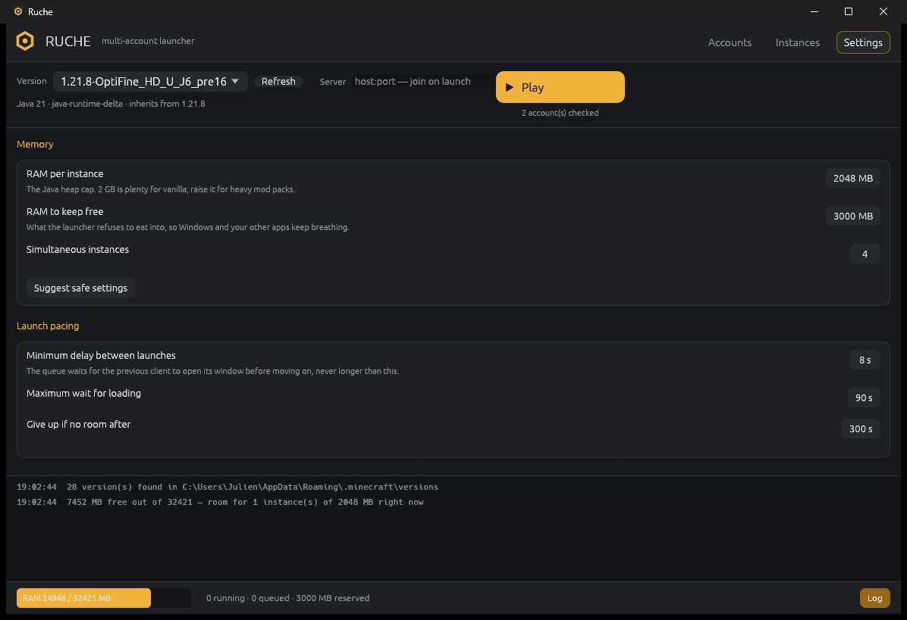
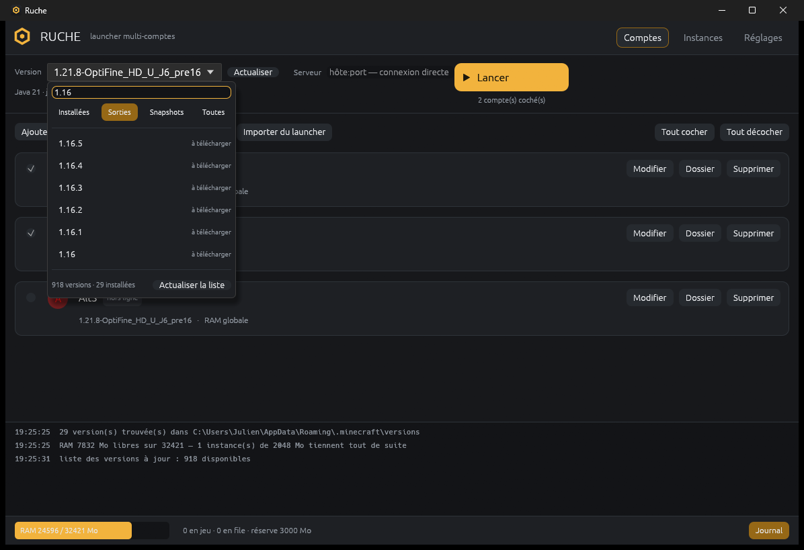

[Français](README.md) · **English**

# Ruche

A multi-account Minecraft launcher for Windows, written in Rust. It opens
several clients side by side **without bringing the machine to its knees**: one
instance starts at a time, and nothing launches unless enough RAM is left.

*Ruche* is French for beehive — many workers in a single frame, a colony that
regulates itself. That is the whole idea.

It builds on the official installation (`%APPDATA%\.minecraft`) — vanilla,
OptiFine, Fabric and Forge included, the `inheritsFrom` chain is resolved — and
downloads on demand the versions that are not there yet.



## Install

A single file, nothing to set up:

1. grab `ruche.exe` from the [releases](../../releases);
2. run it. Configuration lands in `%APPDATA%\Ruche\`.

From source:

```bash
cargo build --release
```

## What keeps the machine alive

| Guard rail | Effect |
|---|---|
| RAM budget | Before every launch: `free RAM − (Xmx + overhead) ≥ reserve`. Otherwise the instance waits in the queue, then gives up with a clear message. |
| Instance cap | Extra instances wait until a slot frees up. |
| Staggered start | The queue starts **one instance at a time** and only moves on once the previous one has opened its window (detected through `EnumWindows`) or hit the timeout. |
| Modest Xmx, `-XX:-AlwaysPreTouch` | The JVM does not commit its whole heap upfront; G1 with short pauses. |
| Low priority | Clients run at `belownormal` (or `idle`), so the desktop stays responsive. |
| CPU affinity | Each instance is pinned to its own group of cores. |
| Low graphics defaults | Fresh instances get an `options.txt` with render distance 3, 60 FPS cap, sound off, `pauseOnLostFocus:false`. |

The **Suggest safe settings** button re-reads free memory and suggests a number
of instances and cores. It caps at four clients: past that, VRAM gives out before
RAM does.

## Every version

The picker is not limited to what sits in `.minecraft`: it lists **Mojang's
whole catalogue** — over 900 entries, releases, snapshots and old versions —
with a search box and four filters. What is already there is tagged
*installed*, the rest *to download*.



Picking a version you do not have is enough: at launch the queue downloads the
version json, the client jar, the missing libraries and the assets, in that
order, then starts the game. Progress shows up in the instance card, and
**downloads happen before memory is reserved** — no point holding a slot during
a transfer.

Anything already on disk is never fetched again, the client jar and the assets
are checked against their SHA-1, and nothing lands at its final path before it
is complete. A modded profile pulls in the version it inherits from.

The manifest is cached: with no network, the launcher keeps the list and simply
says what it cannot download.

## Accounts

Both kinds live in the same list.

**Offline** — the UUID is derived exactly as an `online-mode=false` server does
(`MD5("OfflinePlayer:<name>")`, UUID v3). *Add in bulk* generates `Alt1…AltN`
in one go; *Import from launcher* pulls names and UUIDs from
`launcher_accounts.json`.

**Premium (Microsoft)** — *device code* flow: the launcher shows a code, you
enter it on `microsoft.com/link`, and the full chain runs (Microsoft → Xbox Live
→ XSTS → Minecraft Services → profile). No password ever passes through the
launcher.

You need **your own Azure application** (free): Microsoft will not issue
Minecraft tokens to an undeclared app.

1. `portal.azure.com` → Microsoft Entra ID → App registrations → New
   registration;
2. supported account types: **personal Microsoft accounts only**, no redirect
   URI;
3. Authentication → **Allow public client flows = Yes**;
4. paste the "Application (client) ID" into the launcher — once, for every
   account.

The Minecraft session lasts 24 h and is refreshed automatically at launch for as
long as the Microsoft refresh token is valid (90 days). That token is encrypted
with **DPAPI** before being written, so `accounts.json` is unreadable from
another Windows session. On other platforms it is stored in the clear — stated
here rather than hidden.

Double-click a row to give an account its own version and heap size: alts on
1.8.9 with 1 GB while the main account runs 26.2 with 4 GB.

## Language

The interface ships in **French** and **English**; pick one in *Settings →
Language and folders* and it applies immediately, log
included. Translations live in [`src/i18n.rs`](src/i18n.rs): every string is
declared once with both versions side by side, and a macro turns them into a
struct of fields — a missing translation fails the build.

## Discord activity

*Settings → Discord* publishes a Rich Presence: how many clients are open,
which version, and a timer since the first launch. **Account names never leave
the machine** — your friends see "3 clients running · on 1.20.1", nothing more.

You need a Discord application, free of charge:

1. `discord.com/developers/applications` → *New Application*;
2. copy the *Application ID* into the launcher;
3. optional: *Rich Presence → Art Assets*, upload an image named `ruche` for
   the activity icon.

The launcher speaks straight to the local IPC pipe
(`\\.\pipe\discord-ipc-N`) with no third-party crate: an eight-byte frame
header, then JSON. If Discord is closed, the pipe is missing, or the connection
drops, it retries quietly and shows the current state under the setting.

## Instances

Every account gets its own game directory
(`%APPDATA%\Ruche\instances\<account>`), which is what avoids file conflicts
between clients. The heavy parts stay shared with `.minecraft`: `assets` and
`libraries` are never copied, and `mods`, `resourcepacks`, `shaderpacks` and
`config` are mounted as NTFS junctions.

The **Server** field (`host:port`) connects straight away on launch:
`--quickPlayMultiplayer` on 1.20+, `--server/--port` before that, and the entry
is added to the instance's `servers.dat`.

Each launch writes `instances/<account>/logs/ruche-<date>.log`, whose first line
is the complete Java command — replayable as is.

## Architecture

| Module | Role |
|---|---|
| `mc::version` | reads the json files in `versions/`, merges `inheritsFrom`, evaluates OS and feature rules |
| `mc::manifest` | Mojang catalogue, merged with local profiles, cached on disk |
| `mc::install` | downloads the json, the jar, the libraries and the assets |
| `mc::command` | classpath, natives, argument substitution, `options.txt`, `servers.dat` |
| `mc::java` | JRE selection (official launcher runtimes, system JDKs, `PATH`) |
| `queue` | launch queue, memory guard rails, process monitoring |
| `auth` | offline UUIDs and Microsoft sign-in |
| `sys` | memory, working set, window detection, affinity, DPAPI |
| `i18n` | both languages, declared side by side |
| `discord` | Rich Presence, straight over the IPC pipe |
| `app` | egui interface |

One detail that is expensive to get wrong: **the client jar on the classpath must
be the one inside the selected version's folder**, not the `inheritsFrom`
parent's. Installers copy it under their own name, and Forge's `ignoreList` only
covers that name — using the parent's jar makes Forge ≥ 1.17 fail with a
`ResolutionException`.

## Tests

```bash
cargo test
```

Unit tests cover version merging, rule evaluation, maven paths, offline UUIDs
(against reference values), the `servers.dat` NBT layout, DPAPI round-trips, and
the refusal to launch without memory.

One test talks to the **real** Discord (checking the pipe, the frame
encoding and how a refusal is detected) and two others **actually start the
game**; all of them need something from the machine, so they are ignored by
default:

```bash
cargo test --test real_launch -- --ignored --nocapture
cargo test --test real_install -- --ignored --nocapture
cargo test --lib discord -- --ignored --nocapture
```

`real_install` deletes a version from disk, reinstalls it from Mojang's servers
and checks the launch command is complete; it also removes one asset to make
sure it comes back byte for byte.

Verified on the development machine: 1.7.10, 1.8 / 1.8.8 / 1.8.9, 1.12.2,
1.20.1, 1.20.1-Forge 47.4.13, 1.20.2-Forge 48.1.0, 1.21.8, 1.21.11, OptiFine,
Fabric 0.18/0.19, 26.1.2, 26.2 — 24 profiles produce a complete command line,
and 1.8.9, Forge 1.20.1 and 26.2 reach the game screen.

## Known limits

- Windows is the target: window detection, affinity and DPAPI are native there.
  The rest compiles elsewhere in degraded mode.
- Missing libraries are fetched on the fly when the json provides a URL;
  otherwise the launch stops with the list of files.

## License

MIT — see [LICENSE](LICENSE).
