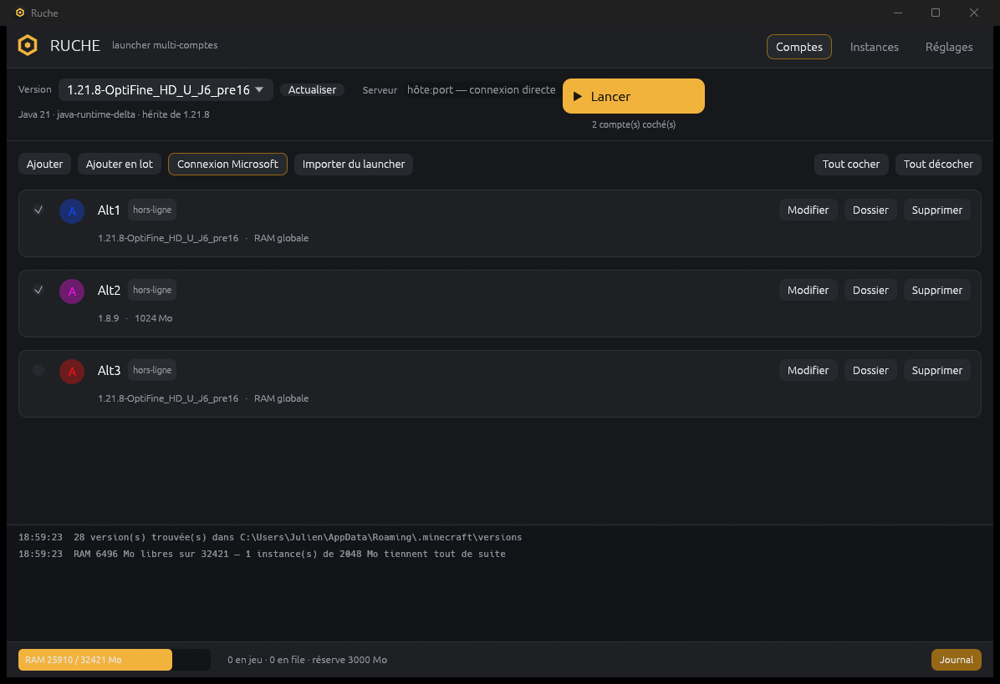

**Français** · [English](README.en.md)

# Ruche

Launcher Minecraft multi-comptes pour Windows, écrit en Rust. Il ouvre plusieurs
clients côte à côte **sans mettre la machine à genoux** : une instance démarre à
la fois, et rien ne se lance s'il ne reste pas assez de RAM.

Une ruche, c'est beaucoup d'ouvrières dans un seul cadre, et une colonie qui se
régule d'elle-même. C'est tout le programme.

Il ne télécharge aucune version : il réutilise l'installation officielle
(`%APPDATA%\.minecraft`) — vanilla, OptiFine, Fabric et Forge compris, la chaîne
`inheritsFrom` est résolue.



## Installation

Un seul fichier, rien à installer :

1. récupérer `ruche.exe` dans les [releases](../../releases) ;
2. le lancer. La configuration atterrit dans `%APPDATA%\Ruche\`.

Depuis les sources :

```bash
cargo build --release
```

## Ce qui empêche le PC de tomber

| Garde-fou | Effet |
|---|---|
| Budget RAM | Avant chaque lancement : `RAM libre − (Xmx + surcoût) ≥ réserve`. Sinon l'instance patiente dans la file, puis est abandonnée avec un message clair. |
| Plafond d'instances | Les suivantes attendent qu'une place se libère. |
| Démarrage décalé | La file lance **une instance à la fois** et n'enchaîne que lorsque la précédente a ouvert sa fenêtre (détectée par `EnumWindows`) ou dépassé le délai maximum. |
| Xmx modeste, `-XX:-AlwaysPreTouch` | La JVM ne réserve pas tout son tas au démarrage ; G1 avec pauses courtes. |
| Priorité basse | Les clients tournent en `belownormal` (ou `idle`) : le bureau garde la main. |
| Affinité CPU | Chaque instance est épinglée sur son propre groupe de cœurs. |
| Réglages graphiques bas | Les instances neuves reçoivent un `options.txt` en distance de rendu 3, 60 FPS, son coupé, `pauseOnLostFocus:false`. |

Le bouton **Calculer un réglage sûr** relit la RAM libre et propose un nombre
d'instances et de cœurs. Il plafonne à quatre clients : au-delà, c'est la VRAM
qui lâche avant la RAM.

## Comptes

Les deux types cohabitent dans la même liste.

**Hors-ligne** — l'UUID est calculé comme le fait un serveur en
`online-mode=false` (`MD5("OfflinePlayer:<pseudo>")`, UUID v3). *Ajouter en lot*
génère `Alt1…AltN` d'un coup ; *Importer du launcher* reprend pseudos et UUID de
`launcher_accounts.json`.

**Premium (Microsoft)** — flux *device code* : le launcher affiche un code, on le
saisit sur `microsoft.com/link`, et la chaîne complète se déroule (Microsoft →
Xbox Live → XSTS → Minecraft Services → profil). Aucun mot de passe ne transite
par le launcher.

Il faut une **application Azure personnelle** (gratuite) : Microsoft ne délivre
pas de jeton Minecraft à une application non déclarée.

1. `portal.azure.com` → Microsoft Entra ID → Inscriptions d'applications →
   Nouvelle inscription ;
2. comptes pris en charge : **comptes Microsoft personnels uniquement**, aucune
   URI de redirection ;
3. Authentification → **Autoriser les flux client publics = Oui** ;
4. coller l'« ID d'application (client) » dans le launcher (une seule fois, pour
   tous les comptes).

La session Minecraft dure 24 h et se renouvelle automatiquement au lancement
tant que le jeton de rafraîchissement Microsoft est valide (90 jours). Ce jeton
est chiffré par **DPAPI** avant d'être écrit : `accounts.json` est illisible
depuis une autre session Windows. Sur les autres systèmes, il est stocké en
clair — c'est signalé ici, pas dissimulé.

Double-clic sur une ligne : version et RAM propres à ce compte, par exemple les
alts en 1.8.9 à 1 Go pendant que le compte principal est en 26.2 à 4 Go.

## Instances

Chaque compte a son dossier de jeu (`%APPDATA%\Ruche\instances\<compte>`),
ce qui évite les conflits de fichiers entre clients. Ce qui est lourd reste
partagé avec `.minecraft` : `assets` et `libraries` ne sont jamais recopiés, et
`mods`, `resourcepacks`, `shaderpacks`, `config` sont montés en jonction NTFS.

Le champ **Serveur** (`hôte:port`) connecte directement au lancement :
`--quickPlayMultiplayer` sur 1.20+, `--server/--port` avant, et l'entrée est
ajoutée au `servers.dat` de l'instance.

Chaque lancement écrit `instances/<compte>/logs/ruche-<date>.log`, dont la
première ligne est la commande Java complète — rejouable telle quelle.

## Architecture

| Module | Rôle |
|---|---|
| `mc::version` | lecture des json de `versions/`, fusion `inheritsFrom`, règles d'OS et de features |
| `mc::command` | classpath, natives, substitution des arguments, `options.txt`, `servers.dat` |
| `mc::java` | choix du JRE (runtimes du launcher officiel, JDK système, `PATH`) |
| `queue` | file de lancement, garde-fous mémoire, surveillance des process |
| `auth` | UUID hors-ligne et connexion Microsoft |
| `sys` | mémoire, working set, détection de fenêtre, affinité, DPAPI |
| `app` | interface egui |

Un détail qui coûte cher si on le rate : **le jar client à mettre au classpath
est celui du dossier de la version choisie**, pas celui du parent `inheritsFrom`
— les installeurs le recopient sous leur propre nom, et l'`ignoreList` de Forge
ne couvre que ce nom-là. Prendre celui du parent fait échouer Forge ≥ 1.17 en
`ResolutionException`.

## Tests

```bash
cargo test
```

Les tests unitaires couvrent la fusion des versions, les règles, les chemins
maven, l'UUID hors-ligne (valeurs de référence), le NBT de `servers.dat`, le
chiffrement DPAPI et le refus de lancer sans mémoire.

Deux tests d'intégration lancent **vraiment** le jeu et demandent une
installation Minecraft ; ils sont donc ignorés par défaut :

```bash
cargo test --test real_launch -- --ignored --nocapture
```

Vérifiés sur cette machine : 1.7.10, 1.8 / 1.8.8 / 1.8.9, 1.12.2, 1.20.1,
1.20.1-Forge 47.4.13, 1.20.2-Forge 48.1.0, 1.21.8, 1.21.11, OptiFine, Fabric
0.18/0.19, 26.1.2, 26.2 — 24 profils produisent une commande complète, et
1.8.9, Forge 1.20.1 et 26.2 atteignent l'écran de jeu.

## Limites

- Windows est la cible : la détection de fenêtre, l'affinité et DPAPI y sont
  natives. Le reste compile ailleurs, en mode dégradé.
- Le launcher ne télécharge pas les versions : une version jamais lancée depuis
  le launcher officiel n'a pas de jar client, et il le dit.
- Les libraries manquantes sont récupérées à la volée quand le json donne une
  URL ; sinon le lancement s'arrête avec la liste des fichiers.

## Licence

MIT — voir [LICENSE](LICENSE).
